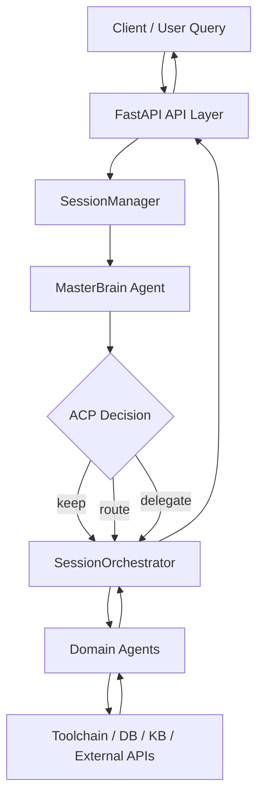
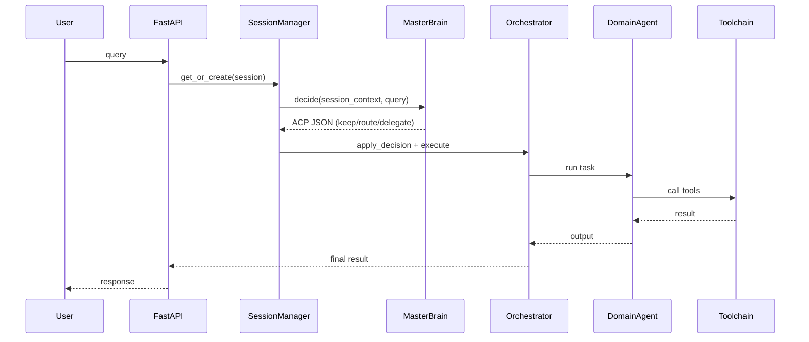

# OrbitAgents

> A production-grade multi-agent backend with decision-routing orchestration.
>
> 面向生产的多智能体决策与编排后端框架

[](#)
[](#)
[](#)
[](#)

---

## 中文速览

- `定位`：多智能体系统底层框架（不是单一业务应用）
- `核心机制`：MasterBrain 只负责决策，Orchestrator 负责执行
- `协同协议`：ACP（`keep` / `route` / `delegate`）
- `适用场景`：多领域智能体、企业助理、知识检索、数据分析等
- `工程价值`：降低多Agent系统复杂度，提高可维护性与可扩展性

---

## Table of Contents

- [Overview](#overview)
- [Research Significance](#research-significance)
- [Core Capabilities](#core-capabilities)
- [Architecture](#architecture)
- [Architecture Diagram](#architecture-diagram)
- [Agent Development Paradigm](#agent-development-paradigm)
- [Paradigm Flow](#paradigm-flow)
- [Project Structure](#project-structure)
- [Quick Start](#quick-start)
- [Configuration](#configuration)
- [API Examples](#api-examples)
- [Roadmap](#roadmap)
- [Contributing](#contributing)
- [Citation](#citation)
- [License](#license)

---

## Overview

`AgentProject-V2.0` is a reusable backend framework for building intelligent multi-agent systems.

It is designed around one key principle:

**Decision and execution must be decoupled.**

The framework introduces:

- `MasterBrain Agent` for central decision making only
- `ACP` (Agent Collaboration Protocol) for structured routing decisions
- `SessionManager + Orchestrator` for runtime state control and task execution
- Pluggable toolchains (RAG, Graph, Coding, Online Search, SQLite, etc.)

---

## Research Significance

This project is not just an engineering demo; it provides a practical research baseline for agent systems:

1. **Methodological significance**
   - Proposes a clear, reusable collaboration model: `MasterBrain(decide) -> Orchestrator(execute) -> Toolchain(return)`.
   - Reduces role confusion in conventional “single-agent do everything” pipelines.

2. **Engineering significance**
   - Builds a standardized way to register agents, manage sessions, and route tasks.
   - Makes multi-agent systems easier to maintain, debug, and extend.

3. **Application significance**
   - Can be adapted to domain scenarios such as healthcare, enterprise assistants, and data operations.
   - Supports gradual evolution from prototype to production-like architecture.

---

## Core Capabilities

- **MasterBrain intelligent routing**
  - ACP actions: `keep`, `route`, `delegate`
- **Session lifecycle management**
  - create / list / delete sessions
  - maintain active agent and routing context
- **Multi-agent collaboration**
  - online search agent
  - RAG agent
  - coding agent
  - graph agent
  - sqlite query agent
- **Multi-modal knowledge base**
  - Text / Excel / PDF / Image ingestion
  - retrieval + rerank pipeline
- **Tool governance**
  - tool input sanitization
  - read-only and query-limit guards (where applicable)

---

## Architecture

```text
Client
  |
  v
FastAPI API Layer
  |
  +--> SessionManager -----------------------------+
  |      - session lifecycle                       |
  |      - MasterBrain decision                    |
  |      - apply ACP decision                      |
  |                                                |
  +--> SessionOrchestrator ------------------------+--> Agent Execution
         - keep/route single-agent handling        |    (RAG / Graph / Coding / Online / ...)
         - delegate multi-subtask handling         |
                                                   +--> Toolchain (DB / KB / External APIs)
```

**Key design rule**: MasterBrain never executes domain tools directly; it only outputs structured decisions.

---

## Architecture Diagram



---

## Agent Development Paradigm

This framework recommends the following development paradigm for any new agent:

### 1) Define role boundary

- What this agent should do
- What this agent must not do
- Input/output contract

### 2) Register tools explicitly

- Keep tools minimal and composable
- Add safety constraints (SQL/Cypher guards, limit controls, allow-list)

### 3) Keep MasterBrain pure-decision

- MasterBrain returns ACP JSON only:
  - `keep`
  - `route(target_agent)`
  - `delegate(sub_tasks[])`

### 4) Execute through orchestrator

- Single path: call selected agent
- Delegate path: run subtasks, aggregate outputs

### 5) Persist runtime context

- Save decision history, active agent, and recent interactions
- Make behavior explainable and replayable

This paradigm improves:

- reproducibility
- explainability
- debugging efficiency
- team collaboration consistency

---

## Paradigm Flow



---

## Project Structure

```text
AgentProject-V2.0/
├─ backend/
│  ├─ app/
│  │  ├─ api/                 # HTTP routes
│  │  ├─ agents/              # Agent specs, tools, registry, master_brain
│  │  ├─ rag/                 # KB storage/retrieval/rerank
│  │  ├─ sessions/            # manager, orchestrator, runtime context
│  │  ├─ services/            # service adapters
│  │  └─ main.py              # FastAPI entrypoint
│  ├─ requirements.txt
│  ├─ cli.py                  # HTTP CLI client
│  └─ local_cli.py            # local runtime CLI
└─ README.md
```

---

## Quick Start

### 1) Install dependencies

```bash
cd backend
python -m venv .venv
.venv\Scripts\activate        # Windows
pip install -r requirements.txt
```

### 2) Configure environment

Create `backend/.env` and set required keys.

### 3) Run server

```bash
uvicorn app.main:app --host 0.0.0.0 --port 8010 --reload
```

Open Swagger docs:

- `http://localhost:8010/docs`

### 4) Optional CLI

```bash
python backend/cli.py
python backend/local_cli.py
```

---

## Configuration

Example `.env`:

```env
DASHSCOPE_API_KEY=your_dashscope_key
SERPAPI_API_KEY=your_serpapi_key
AMAP_KEY=your_amap_key
XINZHI_WEATHER_KEY=your_weather_key

EMAIL_USER=your_email
EMAIL_PASSWORD=your_smtp_password
EMAIL_HOST=smtp.qq.com
EMAIL_PORT=465
```

---

## API Examples

### Create session

```http
POST /api/agent/session/create?session_id=demo
```

### MasterBrain chat (intelligent route)

```http
POST /api/agent/chatMasterBrain
Content-Type: multipart/form-data

session_id=demo
query=帮我查询今天北京天气并总结
```

### Direct single-agent chat

```http
POST /api/agent/chat
Content-Type: multipart/form-data

session_id=demo
query=请搜索医疗AI最新论文
```

### Knowledge ingest (text)

```http
POST /api/knowledge/text
Content-Type: application/json

["知识1", "知识2"]
```

---

## Roadmap

- [ ] Add unified observability (latency/error/routing metrics)
- [ ] Add end-to-end regression tests for ACP paths
- [ ] Add async job queue for long-running tasks
- [ ] Add richer policy engine for tool authorization
- [ ] Add web UI playground for multi-agent flow tracing

---

## Contributing

Contributions are welcome.

1. Fork this repo
2. Create branch: `feature/xxx`
3. Commit with clear message
4. Open Pull Request

Recommended PR scope:

- one feature / one bugfix / one refactor
- include reproducible steps
- include tests or validation notes

---

## Citation

If you use this project in research, please cite:

```bibtex
@misc{agentproject_v2_2026,
  title={AgentProject-V2.0: MasterBrain-Driven Multi-Agent Collaboration Framework},
  author={Project Contributors},
  year={2026},
  howpublished={GitHub Repository}
}
```

---

## License

```
Copyright [2026] [guess-caicai]

Licensed under the Apache License, Version 2.0 (the "License");
you may not use this file except in compliance with the License.
You may obtain a copy of the License at

    http://www.apache.org/licenses/LICENSE-2.0

Unless required by applicable law or agreed to in writing, software
distributed under the License is distributed on an "AS IS" BASIS,
WITHOUT WARRANTIES OR CONDITIONS OF ANY KIND, either express or implied.
See the License for the specific language governing permissions and
limitations under the License.
```
