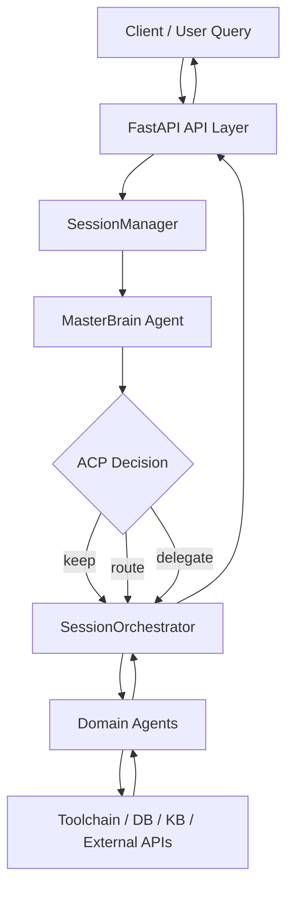
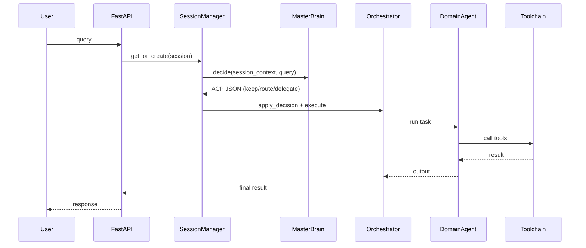

# OrbitAgents

> A production-grade multi-agent backend with decision-routing orchestration.
>
> 面向生产的多智能体决策与编排后端框架

[](#)
[](#)
[](#)
[](#)

---

## 核心亮点

- 低耦合架构：将决策与执行解耦，降低多智能体系统复杂度。
- MasterBrain 路由中枢：集中输出 ACP 决策，统一任务分发入口。
- ACP 决策协议：标准化 keep / 
oute / delegate 三类动作。
- 工具驱动协同：Agent 可按职责调用 RAG、图谱、代码、检索与数据库工具。
- 可扩展工程基线：支持从课程/研究原型平滑演进到生产化形态。

---
## 目录

- [项目概述](#项目概述)
- [研究意义](#研究意义)
- [核心能力](#核心能力)
- [系统架构](#系统架构)
- [架构图](#架构图)
- [Agent 开发范式](#agent-开发范式)
- [范式流程](#范式流程)
- [项目结构](#项目结构)
- [快速开始](#快速开始)
- [配置说明](#配置说明)
- [API 示例](#api-示例)
- [路线图](#路线图)
- [贡献指南](#贡献指南)
- [引用](#引用)
- [许可证](#许可证)

---

## 项目概述

`AgentProject-V2.0` 是一个可复用的多智能体系统后端框架。

其设计围绕一个核心原则：

**决策与执行必须解耦。**

框架关键组成：

- `MasterBrain Agent`：只负责中心化决策
- `ACP`（Agent Collaboration Protocol）：统一结构化路由决策
- `SessionManager + Orchestrator`：管理运行态会话与任务执行
- 可插拔工具链（RAG、Graph、Coding、Online Search、SQLite 等）

---

## 研究意义

该项目不仅是工程演示，也可作为多智能体系统研究的实践基线：

1. **方法论意义**
   - 提出清晰、可复用的协作模型：`MasterBrain(决策) -> Orchestrator(执行) -> Toolchain(回传)`。
   - 降低传统“单 Agent 全包式”流水线中的职责混乱。

2. **工程意义**
   - 建立 Agent 注册、会话管理、任务路由的标准化路径。
   - 让多智能体系统更易维护、调试与扩展。

3. **应用意义**
   - 可迁移到医疗、企业助手、数据运维等垂直场景。
   - 支持从原型逐步演进到接近生产的系统形态。

---

## 核心能力

- **MasterBrain 智能路由**
  - ACP 动作：`keep`、`route`、`delegate`
- **会话生命周期管理**
  - create / list / delete sessions
  - 维护当前活跃 Agent 与路由上下文
- **多 Agent 协同执行**
  - online search agent
  - RAG agent
  - coding agent
  - graph agent
  - sqlite query agent
- **多模态知识库能力**
  - Text / Excel / PDF / Image 入库
  - retrieval + rerank 检索流水线
- **工具治理**
  - 工具输入清洗
  - 只读约束与查询限流（适用场景下）

---

## 系统架构

```text
Client
  |
  v
FastAPI API Layer
  |
  +--> SessionManager -----------------------------+
  |      - session lifecycle                       |
  |      - MasterBrain decision                    |
  |      - apply ACP decision                      |
  |                                                |
  +--> SessionOrchestrator ------------------------+--> Agent Execution
         - keep/route single-agent handling        |    (RAG / Graph / Coding / Online / ...)
         - delegate multi-subtask handling         |
                                                   +--> Toolchain (DB / KB / External APIs)
```

**关键设计约束**：MasterBrain 不直接调用领域工具，只输出结构化决策。

---

## 架构图



---

## Agent 开发范式

框架建议新增 Agent 遵循以下流程：

### 1) 定义角色边界

- 该 Agent 应该做什么
- 该 Agent 明确不能做什么
- 输入/输出契约

### 2) 显式注册工具

- 工具保持最小化、可组合
- 增加安全约束（SQL/Cypher 守卫、限流、白名单）

### 3) 保持 MasterBrain 纯决策

- MasterBrain 仅返回 ACP JSON：
  - `keep`
  - `route(target_agent)`
  - `delegate(sub_tasks[])`

### 4) 统一经编排器执行

- 单路径：调用被选中的 Agent
- 委派路径：执行子任务并聚合输出

### 5) 持久化运行上下文

- 保存决策历史、当前活跃 Agent 与近期交互
- 提高行为可解释性与可回放能力

该范式可显著提升：

- 可复现性
- 可解释性
- 调试效率
- 团队协作一致性

---

## 范式流程



---

## 项目结构

```text
AgentProject-V2.0/
├─ backend/
│  ├─ app/
│  │  ├─ api/                 # HTTP 路由
│  │  ├─ agents/              # Agent 规格、工具、注册、master_brain
│  │  ├─ rag/                 # 知识库存储/检索/rerank
│  │  ├─ sessions/            # manager、orchestrator、运行态上下文
│  │  ├─ services/            # 服务适配层
│  │  └─ main.py              # FastAPI 入口
│  ├─ requirements.txt
│  ├─ cli.py                  # HTTP CLI 客户端
│  └─ local_cli.py            # 本地运行 CLI
└─ README.md
```

---

## 快速开始

### 1) 安装依赖

```bash
cd backend
python -m venv .venv
.venv\Scripts\activate        # Windows
pip install -r requirements.txt
```

### 2) 配置环境变量

创建 `backend/.env` 并填写必需密钥。

### 3) 启动服务

```bash
uvicorn app.main:app --host 0.0.0.0 --port 8010 --reload
```

打开 Swagger 文档：

- `http://localhost:8010/docs`

### 4) 可选 CLI

```bash
python backend/cli.py
python backend/local_cli.py
```

---

## 配置说明

`.env` 示例：

```env
DASHSCOPE_API_KEY=your_dashscope_key
SERPAPI_API_KEY=your_serpapi_key
AMAP_KEY=your_amap_key
XINZHI_WEATHER_KEY=your_weather_key

EMAIL_USER=your_email
EMAIL_PASSWORD=your_smtp_password
EMAIL_HOST=smtp.qq.com
EMAIL_PORT=465
```

---

## API 示例

### 创建会话

```http
POST /api/agent/session/create?session_id=demo
```

### MasterBrain 聊天（智能路由）

```http
POST /api/agent/chatMasterBrain
Content-Type: multipart/form-data

session_id=demo
query=请帮我分析今天上海天气，并给出出行建议
```

### 直接单 Agent 聊天

```http
POST /api/agent/chat
Content-Type: multipart/form-data

session_id=demo
query=请帮我查询数据库中最近一周的订单趋势
```

### 知识入库（文本）

```http
POST /api/knowledge/text
Content-Type: application/json

["示例文本1", "示例文本2"]
```

---

## 路线图

- [ ] 增加统一可观测性（时延/错误/路由指标）
- [ ] 增加 ACP 路径端到端回归测试
- [ ] 增加长任务异步队列
- [ ] 增加更细粒度工具授权策略引擎
- [ ] 增加多智能体流程追踪的 Web UI Playground

---

## 贡献指南

欢迎贡献。

1. Fork 本仓库
2. 创建分支：`feature/xxx`
3. 使用清晰提交信息完成提交
4. 发起 Pull Request

建议 PR 范围：

- 单功能 / 单修复 / 单重构
- 提供可复现步骤
- 附带测试或验证说明

---

## 引用

若将本项目用于研究，请引用：

```bibtex
@misc{agentproject_v2_2026,
  title={AgentProject-V2.0: MasterBrain-Driven Multi-Agent Collaboration Framework},
  author={Project Contributors},
  year={2026},
  howpublished={GitHub Repository}
}
```

---

## 许可证

```
Copyright [2026] [guess-caicai]

Licensed under the Apache License, Version 2.0 (the "License");
you may not use this file except in compliance with the License.
You may obtain a copy of the License at

    http://www.apache.org/licenses/LICENSE-2.0

Unless required by applicable law or agreed to in writing, software
distributed under the License is distributed on an "AS IS" BASIS,
WITHOUT WARRANTIES OR CONDITIONS OF ANY KIND, either express or implied.
See the License for the specific language governing permissions and
limitations under the License.
```

